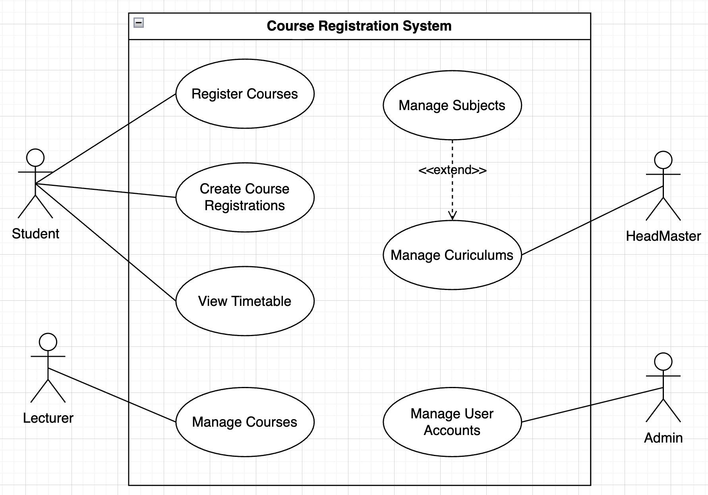

# Backend Traning

app/
├── apis/              → Nơi định nghĩa route (controller)
├── views/             → Xử lý logic hiển thị hoặc trả response (view)
├── models/            → Các model ORM (Model)
├── hooks/             → Các listener & event hooks (lifecycle)
├── decorators/        → Các hàm decorator hỗ trợ validation, auth, logging
├── misc/              → Các tiện ích phụ trợ như logging, config chung
├── extensions.py      → Khởi tạo các phần mở rộng (ORM, cache, v.v.)
└── __init__.py        → Dùng để khởi tạo app và liên kết các phần trên